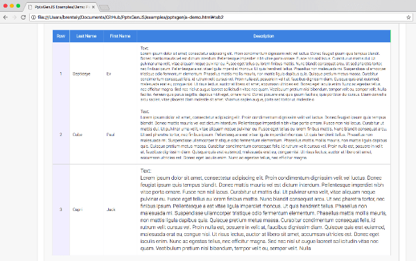
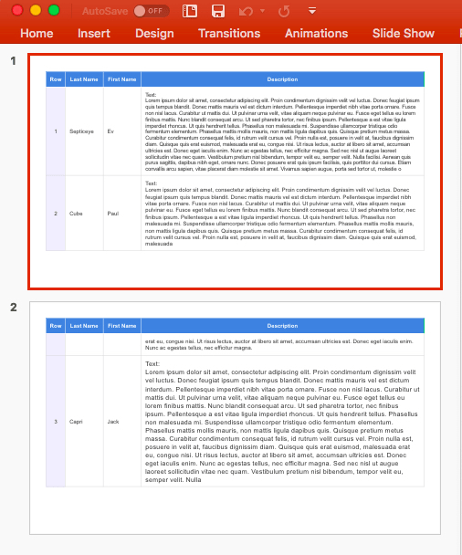

The `tableToSlides` method reproduces an HTML table across one or more slides (auto-paging).

- Supported cell styling includes background colors, borders, fonts, padding, etc.
- Slide margin settings can be set using options, or by providing a Master Slide definition

Notes:

- CSS styles are only supported down to the cell level (word-level formatting is not supported)
- Nested tables are not supported in PowerPoint, therefore they cannot be reproduced (only the text will be included)

## HTML to PowerPoint Syntax

```typescript
slide.tableToSlides(htmlElementID);
slide.tableToSlides(htmlElementID, { OPTIONS });
```

## HTML to PowerPoint Options (`ITableToSlidesOpts`)

| Option               | Type    | Default | Description                                        | Possible Values                                                                         |
| :------------------- | :------ | :------ | :------------------------------------------------- | :-------------------------------------------------------------------------------------- |
| `x`                  | number  | `1.0`   | horizontal location (inches)                       | 0-256. Table will be placed here on each Slide                                          |
| `y`                  | number  | `1.0`   | vertical location (inches)                         | 0-256. Table will be placed here on each Slide                                          |
| `w`                  | number  | `100%`  | width (inches)                                     | 0-256.                                                                                  |
| `h`                  | number  | `100%`  | height (inches)                                    | 0-256.                                                                                  |
| `addHeaderToEach`    | boolean | `false` | add table headers to each slide                    | Ex: `{addHeaderToEach: true}`                                                           |
| `addImage`           | string  |         | add an image to each slide                         | Ex: `{addImage: {image: {path: "images/logo.png"}, options: {x: 1, y: 1, w: 1, h: 1}}}` |
| `addShape`           | string  |         | add a shape to each slide                          | Use the established syntax                                                              |
| `addTable`           | string  |         | add a table to each slide                          | Use the established syntax                                                              |
| `addText`            | string  |         | add text to each slide                             | Use the established syntax                                                              |
| `autoPage`           | boolean | `true`  | create new slides when content overflows           | Ex: `{autoPage: false}`                                                                 |
| `autoPageCharWeight` | number  | `0.0`   | character weight used to determine when lines wrap | -1.0 to 1.0. Ex: `{autoPageCharWeight: 0.5}`                                            |
| `autoPageLineWeight` | number  | `0.0`   | line weight used to determine when tables wrap     | -1.0 to 1.0. Ex: `{autoPageLineWeight: 0.5}`                                            |
| `colW`               | number  |         | table column widths                                | Array of column widths. Ex: `{colW: [2.0, 3.0, 1.0]}`                                   |
| `masterSlideName`    | string  |         | master slide to use                                | [Slide Masters](#slide-masters) name. Ex: `{master: 'TITLE_SLIDE'}`                     |
| `newSlideStartY`     | number  |         | starting location on Slide after initial           | 0-(slide height). Ex: `{newSlideStartY:0.5}`                                            |
| `slideMargin`        | number  | `1.0`   | margins to use on Slide                            | Use a number for same TRBL, or use array. Ex: `{margin: [1.0,0.5,1.0,0.5]}`             |

## HTML to PowerPoint Table Options

Add a `data` attribute to the table's `<th>` tag to manually size columns (inches)

- minimum column width can be specified by using the `data-pptx-min-width` attribute
- fixed column width can be specified by using the `data-pptx-width` attribute

Example:

```HTML
<table id="tabAutoPaging" class="tabCool">
  <thead>
    <tr>
      <th data-pptx-min-width="0.6" style="width: 5%">Row</th>
      <th data-pptx-min-width="0.8" style="width:10%">Last Name</th>
      <th data-pptx-min-width="0.8" style="width:10%">First Name</th>
      <th data-pptx-width="8.5"     style="width:75%">Description</th>
    </tr>
  </thead>
  <tbody></tbody>
</table>
```

## HTML to PowerPoint Notes

- Master Slides should already define margins, so a Master Slide name is typically the only option required
- Hidden tables will not auto-size their columns correctly (the required properties are not accurate)

## HTML to PowerPoint Examples

```typescript
// Pass table element ID to tableToSlides function to produce 1-N slides
pptx.tableToSlides("myHtmlTableID");

// Optionally, include a Master Slide name for pre-defined margins, background, logo, etc.
pptx.tableToSlides("myHtmlTableID", { master: "MASTER_SLIDE" });

// Optionally, add images/shapes/text/tables to each Slide
pptx.tableToSlides("myHtmlTableID", {
  addText: { text: "Dynamic Title", options: { x: 1, y: 0.5, color: "0088CC" } },
});
pptx.tableToSlides("myHtmlTableID", {
  addImage: { path: "images/logo.png", x: 10, y: 0.5, w: 1.2, h: 0.75 },
});
```

### HTML Table



### Resulting Slides



## HTML to PowerPoint Integration Patterns

Design a Master Slide that already contains the slide layout, margins, and logos. A complete presentation
can then be produced with a single line of code, embedded in a link or a button.

Add a button to a webpage that creates a presentation from the table data currently present:

```html
<button onclick="{ var pptx=new PptxGenJS(); pptx.tableToSlides('tableId'); pptx.writeFile(); }" type="button">Export to PPTX</button>
```

## SharePoint Integration

Placing a button like this into a WebPart is a practical way to add "Export to PowerPoint" functionality
to SharePoint. The PptxGenJS bundle `<script>` must also be added to that or another WebPart.
