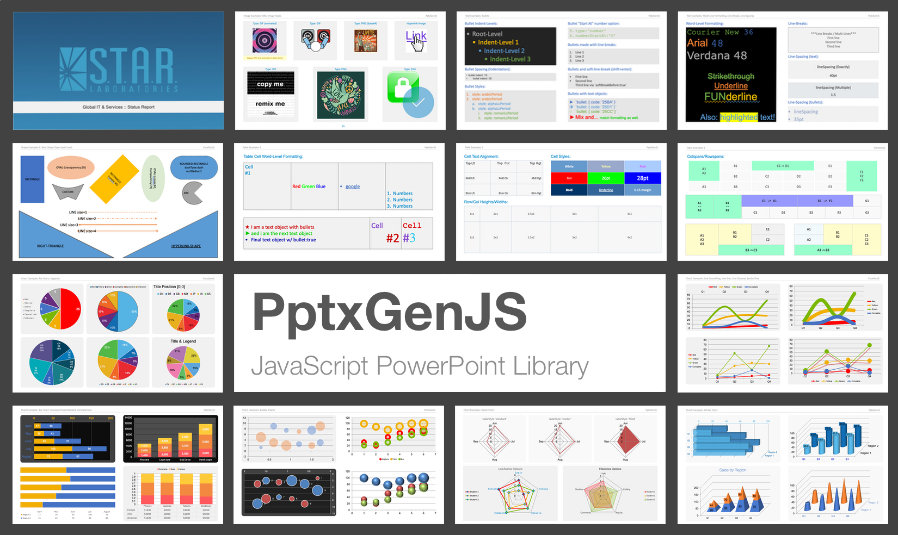

**PptxGenJS generates PowerPoint (`.pptx`) files from JavaScript** — in Node, the browser, and every
common framework. This is `@neo-ma/pptxgenjs`, the NEOMA-maintained fork with a modern build and typed API.

If you are migrating from the original `pptxgenjs` package, see the [Migration guide](./migration) — it is
a drop-in replacement.

## How the API works

The library is built on a small object model with three levels:

```
Presentation                 new pptxgen()
└── Slide                    pres.addSlide()
    ├── Text                 slide.addText(...)
    ├── Table                slide.addTable(...)
    ├── Shape                slide.addShape(...)
    ├── Image                slide.addImage(...)
    ├── Chart                slide.addChart(...)
    └── Media                slide.addMedia(...)
```

1. **Create a Presentation** — `new pptxgen()`. This is the document.
2. **Add Slides** — `pres.addSlide()` returns a Slide you add content to.
3. **Add objects to a Slide** — every object is one `slide.addX(...)` call that takes the content plus an
   **options object**. Options follow the same conventions everywhere: position and size are `x`, `y`, `w`,
   `h` in **inches** (or `%`), and colors are hex strings without `#` (e.g. `"363636"`).
4. **Save** — `pres.writeFile()` (Node/browser download) or `pres.write(...)` for a Blob/Buffer/base64/stream.

This is the complete API surface. The remaining documentation describes the options each `addX` method accepts.

### Hello World

```typescript
import pptxgen from "@neo-ma/pptxgenjs"

const pres = new pptxgen()
const slide = pres.addSlide()

slide.addText("Hello World from PptxGenJS!", { x: 1, y: 1, w: "80%", h: 1, fontSize: 24, color: "363636" })

await pres.writeFile({ fileName: "HelloWorld.pptx" })
```

Full TypeScript definitions ship with the package, so your editor autocompletes every method and
option. The type definitions are the most complete reference available.

## Where to go next

- **[Quick Start](./quick-start)** — the four steps above, shown for Node and the browser.
- **[Installation](./installation)** — npm, yarn, and CDN.
- **[Compatibility](./compatibility)** and **[Integration](./integration)** — bundlers, frameworks, and runtimes.
- **Usage** (sidebar) — presentation and slide options, and how to save.
- **API Reference** (sidebar) — the options for [Text](./api-text), [Tables](./api-tables),
  [Shapes](./api-shapes), [Images](./api-images), [Charts](./api-charts), and [Media](./api-media).
- **[HTML to PowerPoint](./html-to-powerpoint)** — turn an HTML `<table>` into slides in one call.

## Output compatibility

Files are standards-compliant Open Office XML (OOXML) and open in Microsoft PowerPoint, Apple Keynote,
LibreOffice Impress, and Google Slides (via import).

## Issues and contributing

File issues or ideas on the [issues page](https://github.com/NeomaVerwaltung/PptxGenJS/issues/new), or
[open a pull request](https://github.com/NeomaVerwaltung/PptxGenJS/pulls). When reporting a problem, include
a short code snippet that reproduces it. Documentation lives in-repo under
[`docs/`](https://github.com/NeomaVerwaltung/PptxGenJS/tree/master/docs) — the "Edit this page" link on any
page leads directly to its source file.

## Contributors

This fork builds on the work of [Brent Ely](https://github.com/gitbrent/) and the original PptxGenJS
contributors:

- [Dzmitry Dulko](https://github.com/DzmitryDulko) — getting the project published on NPM
- [Michal Kacerovský](https://github.com/kajda90) — Master Slide layouts and chart expertise
- [Connor Bowman](https://github.com/conbow) — placeholders
- [Reima Frgos](https://github.com/ReimaFrgos) — chart and general functionality patches
- [Matt King](https://github.com/kyrrigle), [Mike Wilcox](https://github.com/clubajax) — chart expertise
- [Joonas](https://github.com/wyozi) — [react-pptx](https://github.com/wyozi/react-pptx)

PowerPoint shape definitions and some XML via the [Officegen Project](https://github.com/Ziv-Barber/officegen).

## License

Copyright &copy; 2015-present [Brent Ely](https://github.com/gitbrent/), &copy; 2026-present NEOMA GmbH

[MIT](https://github.com/NeomaVerwaltung/PptxGenJS/blob/master/LICENSE)
